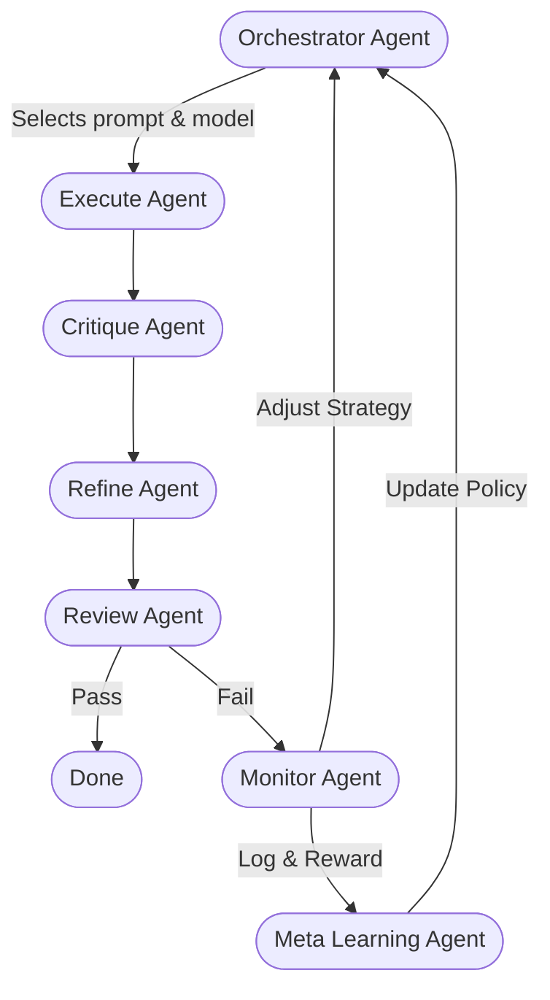

# 📘 PLAN.md – Forge v1.2 (Modular AI Agent System)

> ⚠️ Status note: this document mixes “current implementation” and “planned roadmap”.
> Canonical, up-to-date usage docs live in `docs/*`. Historical plans/backlog live in `archived/*`.

## 🔥 Summary

Forge v1.2 is a modular, agentic AI framework designed to:

* Run **node-based LLM pipelines** (Execute → Critique → Refine → Review)
* Implement a **leadership team** of meta-agents (Orchestrator → Monitor → Meta Learning)
* Support **hot-swappable models** (API & local) with per-role kwargs
* Integrate **LangGraph** as the core DAG engine with stateful nodes
* Allow **dynamic prompt strategies** with runtime model selection
* Learn & adapt with **skrl-based feedback loops**
* Work headlessly via a CLI (`python -m anvil`); an API server is planned but not implemented in this repo
* Use a **centralized config system** (`config/models.yaml`) with provider/model/role kwargs
* Provide **LangChain-compatible** model interfaces under the hood

This system is ideal for experimentation, evals, multi-agent workflows, or AI self-improvement loops.

---

## 🚀 Leadership & Worker Team Architecture

Forge uses a two-tier agent architecture:



1. **Leadership Team**
   - **Orchestrator Agent**: Analyzes tasks and selects optimal models and prompts
   - **Monitor Agent**: Evaluates failures and adjusts strategy
   - **Meta Learning Agent**: Learns from experience via reinforcement learning

2. **Worker Team**
   - **Execute Agent**: Primary task execution
   - **Critique Agent**: Error detection and feedback
   - **Refine Agent**: Improvements based on critique
   - **Review Agent**: Quality assurance and pass/fail decisions

This separation allows sophisticated control and adaptation mechanisms while maintaining a clean execution pipeline.

---

## 🗂️ File Structure Overview

```
forge/
├── anvil/
│   ├── __main__.py                # Module entrypoint: `python -m anvil`
│   ├── cli.py                     # Canonical CLI implementation
│   ├── orchestration/
│   │   ├── graph.py                # `create_forge_graph()` → LangGraphExecutor
│   │   ├── langgraph_builder.py    # LangGraph topology builder
│   │   ├── langgraph_executor.py   # Executor wrapper (run/execute/stream)
│   │   ├── state.py                # ForgeState + serialization helpers
│   │   └── nodes/
│   │       ├── orchestrator.py
│   │       ├── execute.py
│   │       ├── critique.py
│   │       ├── refine.py
│   │       ├── review.py
│   │       ├── reflect.py
│   │       ├── monitor.py
│   │       ├── meta_learning.py
│   │       └── finalize.py
│   ├── providers/
│   │   ├── base.py
│   │   ├── openai.py
│   │   ├── anthropic.py
│   │   ├── openrouter.py
│   │   ├── huggingface.py
│   │   ├── llama_cpp.py
│   │   └── __init__.py
│   ├── rl/
│   │   ├── policy.py
│   │   └── rewards.py
│   ├── config_loader.py
│   ├── configuration_resolver.py
│   ├── orchestrator.py
│   └── utils.py
├── archived/                       # Historical/backlog docs and placeholders
├── config/
│   └── models.yaml                 # Model registry + pipeline configuration
├── docs/
│   └── *.md
├── tests/
│   └── *.py
├── pyproject.toml                  # Poetry configuration
├── poetry.lock                     # Poetry lock file
├── archived/enhanced_forge_cli_fixed.py  # Archived legacy/alternate CLI script
└── README.md                       # Project overview
```

---

## 📦 Core Modules Explained

### 🧠 `config/models.yaml`

The centralized provider configuration file:

* Defines all available model providers
* Sets per-role kwargs via `models.<model_name>/*.<role>`
* Supports wildcard configuration (`model/*`)
* Configures both API and local models with appropriate parameters
* Enables dynamic provider instantiation via `class_path`

Example structure:
```yaml
providers:
  openai:
    type: api
    class_path: anvil.providers.openai.OpenAIProvider
    key_env: OPENAI_API_KEY
    model_name: gpt-4o-mini
    models:
      gpt-4o-mini/*:
        execute:
          temperature: 0.7
          max_tokens: 512
        critique:
          temperature: 0.4
          max_tokens: 300
```

---

### 🧩 `anvil/config_loader.py`

* Loads and validates the config YAML with Pydantic models
* Implements a caching system for efficient reloads
* Provides configuration watcher for hot-reload capability
* Returns structured provider configurations and pipeline definitions
* Handles environment variable substitution for API keys

---

### 🧱 `anvil/providers/`

* Defines a **registry system** for dynamic model provider instantiation
* Each provider subclass wraps a different backend (API or local)
* Common interface: `generate(prompt)`, `chat(messages)`, etc.
* Hot-swappable providers that can be reloaded at runtime
* LangChain compatibility layer for integration with LangChain ecosystem

Provider instantiation via `class_path`:
```python
# Dynamic instantiation based on config
module_path, cls_name = cfg.class_path.rsplit(".", 1)
ProviderCls = getattr(importlib.import_module(module_path), cls_name)
provider_instance = ProviderCls(cfg)
```

---

### 🧠 `utils.py`

Key function for role-based kwargs merging at runtime:

```python
def merged_kwargs(role, provider_cfg, state_override=None):
    """
    Merge configuration parameters with priority:
    1. Runtime overrides from state
    2. Role-specific configuration for this model
    3. Default role configuration
    4. Global defaults
    """
    # Implementation merges these with proper priority
```

This enables fine-grained control of model parameters while maintaining defaults.

---

### 📃 `orchestration/state.py`

* Defines the stateful context that flows through the LangGraph
* Tracks execution history, logs, and intermediate results
* Provides access to current pipeline configuration
* Includes convenience methods for accessing merged kwargs
* Maintains a trace of execution for analysis and debugging

```python
class ForgeState:
    def __init__(self, task, pipeline=None):
        self.task = task
        self.pipeline = pipeline or DEFAULT_PIPELINE
        self.logs = {}
        self.history = []
        self.result = None
        self.prompts = {}
        self.attempts = 0
        self.task_metadata = {}
        
    def role_kwargs(self, role, overrides=None):
        """Get merged kwargs for this role with optional overrides"""
```

---

### 🕸️ `orchestration/nodes/*.py`

Each node implements a specific stage in the pipeline. The system has two categories of nodes:

#### Leadership Nodes

```python
def orchestrator_node(state):
    """Analyze task and select optimal models and prompts"""
    # Task analysis
    task_type = analyze_task_type(state.task)
    complexity = estimate_complexity(state.task)
    
    # Model and prompt selection
    models = select_models_for_pipeline(task_type, complexity)
    prompts = select_prompts_for_pipeline(task_type, complexity)
    
    # Update state with selections
    state.pipeline = models
    state.prompts = prompts
    state.task_metadata = {
        "type": task_type,
        "complexity": complexity,
        "strategy": "initial"
    }
    
    return state

def monitor_node(state):
    """Analyze failure and adjust strategy"""
    # Analyze failure
    failure_analysis = analyze_failure(
        state.logs["execute"],
        state.logs["critique"],
        state.logs["refine"],
        state.logs["review"]
    )
    
    # Update state with adjustments
    state.pipeline = adjusted_models
    state.logs["monitor"] = failure_analysis
    
    return state

def meta_learning_node(state):
    """Update policies and learn from experience"""
    # Extract learning signals
    rewards = calculate_rewards(state)
    
    # Update policies
    update_model_selection_policy(state, rewards)
    
    return state
```

#### Worker Nodes

```python
def execute_node(state):
    """Execute the primary task using the selected model"""
    prov_key = state.pipeline["execute"]
    kwargs = state.role_kwargs("execute")
    provider = get_provider(prov_key)
    
    # Create prompt from task
    if "execute" in state.prompts:
        # Use prompt template from orchestrator
        prompt = state.prompts["execute"].format(task=state.task)
    else:
        # Default prompt
        prompt = f"Please complete the following task: {state.task}"
    
    # Execute task
    result = provider.generate(prompt, **kwargs)
    
    # Update state
    state.logs["execute"] = result
    return state
```

---

### 🌐 `orchestration/graph.py`

* Implements a LangGraph DAG with stateful nodes
* Integrates both leadership and worker nodes
* Enables conditional routing based on review results
* Supports dynamic model selection via the state object
* Handles retry logic and exit conditions

Example LangGraph implementation with leadership team:
```python
def create_forge_graph():
    # Create the graph with our state type
    graph = StateGraph(ForgeState)
    
    # Add leadership nodes
    graph.add_node("orchestrator", orchestrator_node)
    graph.add_node("monitor", monitor_node)
    graph.add_node("meta_learning", meta_learning_node)
    
    # Add worker nodes
    graph.add_node("execute", execute_node)
    graph.add_node("critique", critique_node)
    graph.add_node("refine", refine_node)
    graph.add_node("review", review_node)
    
    # Connect leadership to workers
    graph.add_edge("orchestrator", "execute")
    
    # Connect worker pipeline
    graph.add_edge("execute", "critique")
    graph.add_edge("critique", "refine")
    graph.add_edge("refine", "review")
    
    # Conditional routing based on review
    graph.add_conditional_edges(
        "review",
        lambda state: "pass" if state.logs.get("review", {}).get("pass", False) else "fail",
        {
            "pass": END,
            "fail": "monitor"
        }
    )
    
    # Connect monitor back to execution
    graph.add_edge("monitor", "meta_learning")
    graph.add_edge("meta_learning", "orchestrator")
    
    # Set entry point
    graph.set_entry_point("orchestrator")
    
    return graph.compile()
```

---

### 🔁 `policy.py` and RL Components

* Responsible for choosing which models to use per pipeline step
* Implements both rule-based and learned policies
* Integrates with skrl for policy learning
* Provides fallback mechanisms for reliability
* Adapts based on task type and model availability

The reinforcement learning components play a critical role in the leadership team:
* Treat each task execution as an RL episode
* Define reward signals based on task success, critique quality, etc.
* Update model selection policies based on performance
* Store performance data for continuous improvement

---

### 🔄 Hot-Swapping & Reloading

The system implements robust hot-reloading capabilities:

```python
def reload_config(path="config/models.yaml"):
    """
    Reload the configuration and update all registered providers.
    This allows changing models without restarting the application.
    """
    # Implementation reloads config and updates providers
```

This enables:
* Changing models without restarting
* Updating model parameters on the fly
* Testing different configurations rapidly
* A/B testing of different model combinations

---

### 🌐 API & CLI Integration

#### Current (implemented)

* CLI entrypoint: `python -m anvil` (see `anvil/cli.py`)
* LangGraph backend is always used (`anvil/orchestration/graph.py`)

#### Planned (not implemented in this repo)

* FastAPI server exposing `/forge/run` and admin endpoints

---

## 🧪 Testing Plan

### Unit Testing

* Test `merged_kwargs()` with various configuration scenarios
* Verify provider registration and instantiation
* Test state management and history tracking
* Validate node implementations with mock providers

### Integration Testing

* Test end-to-end pipeline execution
* Verify LangGraph conditional routing
* Test hot-reloading functionality
* Validate CLI and API interfaces

### Performance Testing

* Measure execution time for different model combinations
* Evaluate throughput for API server
* Test concurrent execution scenarios

---

## 🛠️ Implementation Phases & Progress

### ✅ Phase 1: Core Infrastructure (Complete)

* [x] Implement `config_loader.py` with Pydantic models
* [x] Build provider registry with dynamic instantiation
* [x] Implement `merged_kwargs` for parameter resolution
* [x] Create provider implementations for various backends
* [x] Set up basic project structure and dependencies
* [x] Cleaned up unused provider implementations to focus on working providers

**Incremental Testing - Phase 1:**
```bash
# Test 1: Verify config loader functionality
python -c "from anvil.config_loader import load_config; print(load_config())"
# Expected: Should print structured config data

# Test 2: Test provider registration and retrieval
python -c "
from anvil.config_loader import load_config
from anvil.providers import register_provider, get_provider
providers, _ = load_config()
register_provider('openai', providers['openai'])
print(get_provider('openai'))
"
# Expected: Should print provider instance info

# Test 3: Check kwargs merging
python -c "
from anvil.config_loader import load_config
from anvil.utils import merged_kwargs
providers, _ = load_config()
print(merged_kwargs('execute', providers['openai']))
print(merged_kwargs('critique', providers['openai']))
"
# Expected: Should print merged kwargs with different values for each role
```

---

### 🔁 Phase 2: Worker Agents & Basic Orchestration (In Progress)

* [ ] Implement `ForgeState` for stateful context
* [ ] Build worker node implementations with proper state handling
* [ ] Implement basic LangGraph orchestration in `graph.py`
* [ ] Add conditional routing based on review outcomes
* [ ] Document the worker agent architecture

**Incremental Testing - Phase 2:**
```bash
# Test 1: Verify ForgeState initialization and role_kwargs method
python -c "
from anvil.orchestration.state import ForgeState
state = ForgeState('test task', {'execute': 'openai', 'critique': 'phi3-mini'})
print(state.task)
print(state.pipeline)
print(state.role_kwargs('execute', {'temperature': 0.5}))
"
# Expected: Should print task, pipeline and merged kwargs

# Test 2: Test execute_node in isolation
python -c "
from anvil.orchestration.state import ForgeState
from anvil.orchestration.nodes.execute import execute_node
from anvil.config_loader import load_config
from anvil.providers import register_provider

# Setup
providers, _ = load_config()
register_provider('openai', providers['openai'])

# Create state and run node
state = ForgeState('Write a short poem', {'execute': 'openai'})
result = execute_node(state)
print(result.logs['execute'])
"
# Expected: Should print execution result

# Test 3: Basic sequential node execution
python -c "
from anvil.orchestration.state import ForgeState
from anvil.orchestration.nodes.execute import execute_node
from anvil.orchestration.nodes.critique import critique_node
from anvil.config_loader import load_config
from anvil.providers import register_provider

# Setup
providers, _ = load_config()
register_provider('openai', providers['openai'])
register_provider('phi3-mini', providers['phi3-mini'])

# Create state and run nodes
state = ForgeState('Calculate 15*37', {'execute': 'openai', 'critique': 'phi3-mini'})
state = execute_node(state)
state = critique_node(state)
print('Execute output:', state.logs['execute'])
print('Critique output:', state.logs['critique'])
"
# Expected: Should print execution and critique results
```

---

### 🎯 Phase 3: Leadership Team Implementation (Planned)

* [ ] Implement `orchestrator_node` for task analysis and model selection
* [ ] Build `monitor_node` for failure analysis and strategy adjustment
* [ ] Create `meta_learning_node` for policy updating
* [ ] Integrate leadership nodes into the LangGraph
* [ ] Implement state persistence for learning across runs
* [ ] Document the leadership team architecture

**Incremental Testing - Phase 3:**
```bash
# Test 1: Verify orchestrator_node functionality
python -c "
from anvil.orchestration.state import ForgeState
from anvil.orchestration.nodes.orchestrator import orchestrator_node

# Create state and run node
state = ForgeState('Write a complex technical explanation about quantum computing')
result = orchestrator_node(state)
print('Selected models:', result.pipeline)
print('Selected prompts:', result.prompts)
print('Task metadata:', result.task_metadata)
"
# Expected: Should print model selections, prompts, and task metadata

# Test 2: Test monitor_node with failure scenario
python -c "
from anvil.orchestration.state import ForgeState
from anvil.orchestration.nodes.monitor import monitor_node

# Create state with failed execution
state = ForgeState('Explain the theory of relativity')
state.logs = {
    'execute': 'E=mc^2 means energy equals mass times the speed of light squared.',
    'critique': 'This is an incomplete explanation that only mentions the equation without explaining the theory.',
    'refine': 'The theory of relativity states that E=mc^2.',
    'review': {'pass': False, 'reason': 'Still inadequate explanation'}
}
result = monitor_node(state)
print('Adjusted strategy:', result.logs['monitor'])
"
# Expected: Should print failure analysis and strategy adjustments

# Test 3: Test meta_learning_node
python -c "
from anvil.orchestration.state import ForgeState
from anvil.orchestration.nodes.meta_learning import meta_learning_node
from anvil.rl.rewards import calculate_rewards

# Create state with execution history
state = ForgeState('Write a poem about AI')
state.logs = {
    'execute': 'Silicon dreams of electric sheep...',
    'critique': 'Good start but lacks depth...',
    'refine': 'In realms of logic, algorithms dance...',
    'review': {'pass': True}
}
result = meta_learning_node(state)
print('Learning outcomes:', result.logs['meta_learning'])
"
# Expected: Should print learning outcomes and policy updates
```

---

### 📡 Phase 4: Interfaces & Tools (Planned)

* [x] Implement CLI interface with core commands (`python -m anvil`)
* [ ] Build FastAPI server with Forge endpoints
* [ ] Add admin interfaces for configuration management
* [x] Implement hot-reloading functionality (`anvil/orchestrator.py:reload_config`)
* [ ] Create monitoring and logging infrastructure

---

### 🧪 Phase 5: Testing & Evaluation (Planned)

* [ ] Implement unit tests for core components
* [ ] Add integration tests for end-to-end scenarios
* [ ] Create test fixtures and data
* [ ] Build benchmark suite for performance testing
* [ ] Implement continuous integration pipeline

---

## 🔍 LangChain Integration

The system implements LangChain compatibility:

* Providers are implemented on top of LangChain model wrappers (see `anvil/providers/base.py`)
* LangChain chains/tools can be built on top of the underlying provider LLMs (see `docs/langchain_integration.md`)

This enables using the rich LangChain ecosystem while keeping the core architecture clean and focused.

---

## 🪄 Future Extensions

* **Hypergraph Memory**: Integration with Hypergraphiti for advanced memory structures
* **Multi-Agent Coordination**: Implement OWL or Qwen-Agent for multi-agent orchestration
* **Custom Reward Models**: Create specialized reward models for different task types
* **Auto-Prompting**: Develop dynamic prompt generation based on task analysis
* **Web Dashboard**: Build a web interface for monitoring and configuration
* **Distributed Execution**: Enable running nodes across multiple machines
* **Quantitative Evaluation**: Implement automated evaluation framework

---

## ✅ What's Working Now

* 🔥 Config-driven provider/model/role routing via `config/models.yaml`
* 🧠 Dynamic role-based kwargs merging at runtime
* 🔌 Hot-swappable model providers with dynamic instantiation (registry + resolver)
* 🕸️ LangGraph orchestration (only backend) with checkpointing env vars
* 🧩 Provider registry with clean abstraction layer
* 🧱 LangChain-compatible model interfaces
* 📑 Documentation for both worker and leadership agent architecture

---

## 📊 Performance Considerations

* **Caching**: Implement response caching for repeated operations
* **Batching**: Support batch processing for higher throughput
* **Streaming**: Enable streaming responses for better UX
* **Concurrency**: Implement async execution for non-dependent nodes
* **Resource Management**: Add graceful handling of rate limits and quotas

---

## 💡 Common Debug Troubleshooting

When developing and testing the system, here are common issues to check:

1. **API Key Issues**
   - Test credentials with the built-in provider smoke tests:
     - `poetry run python -m anvil test openai`
     - `poetry run python -m anvil test anthropic`

2. **Configuration Problems**
   - Verify models.yaml syntax with a YAML validator
   - Ensure `providers.<name>.models` keys match the resolver patterns (e.g. `model_name/*`)
   - Ensure all required fields are present in provider configs

3. **Provider Registration Issues**
   - Verify class_path points to an existing class
   - Check that provider implementations match the expected interface
   - Test providers individually before using in the pipeline

4. **LangGraph Node Issues**
   - Make sure nodes return the state object
   - Check for key errors in state access
   - Verify that conditional routing functions handle edge cases

5. **Module Import Errors**
   - Ensure pythonpath includes project root
   - Check for circular imports
   - Verify all dependencies are installed

---
