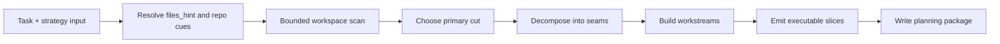
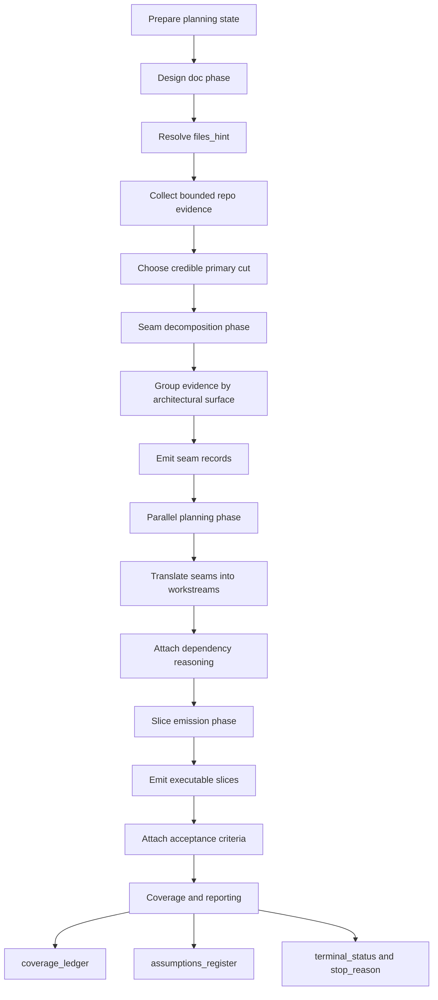
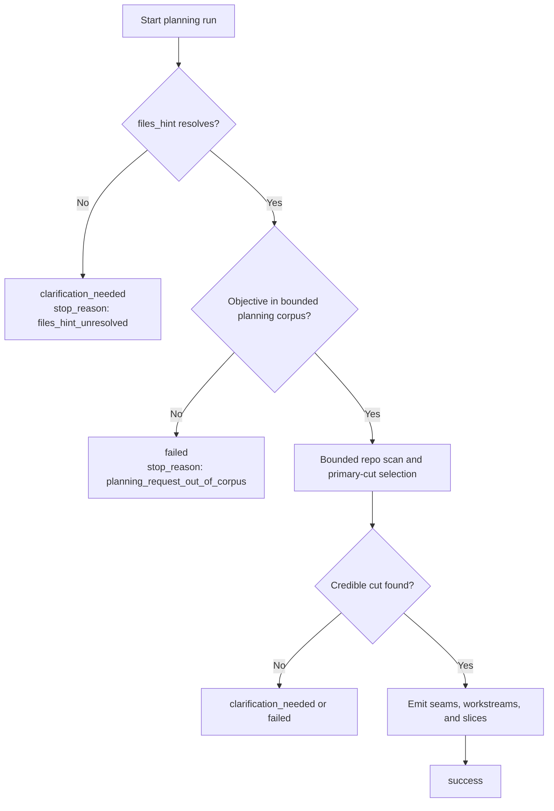
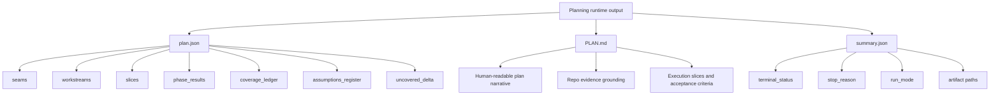

# Planning Runtime Process

This document explains what the current `planning` harness runtime actually
does today.

It is a bounded, deterministic repository-planning engine. Its canonical owner
is still the deterministic layer that inspects local workspace evidence and
emits a structured planning package. When
`planning_execution.mode: graph_owned_with_planner_review` is selected, the
runtime adds one bounded provider-backed review stage after deterministic
structure derivation; that review may annotate or challenge the package, but it
does not replace seams, workstreams, slices, coverage truth, or stop reasons.

Primary implementation entrypoints:

- `anvil/harness/subgraphs/planning_v1.py`
- `anvil/harness/planning_runtime.py`
- `anvil/harness/strategy_graph.py`

## Overview

At a high level, the planner:

1. Resolves `files_hint` and other repo cues into concrete workspace paths.
2. Scans a bounded set of files and candidate matches.
3. Chooses a primary cut, or center-of-gravity area, for the feature.
4. Decomposes that cut into architectural seams.
5. Translates seams into workstreams.
6. Translates workstreams into executable slices with acceptance criteria.
7. Emits coverage, assumptions, and truthful stop reasons.
8. Optionally runs bounded planner review over the finished package.

## Resolution 1: One-Screen Flow

## Resolution 2: Phase-Level Runtime

This view maps the runtime to the four planning phases exposed by
`planning_v1`.

## Resolution 3: Decision and Stop Paths

This view shows why some planning runs return quickly.

## Resolution 4: Artifact Shape

The output is a planning package, not model-generated prose.

## What Each Step Computes

### 1. Resolve `files_hint` and repo cues

The runtime starts from task inputs such as `files_hint`, objective text, and
workspace state. It converts those hints into concrete repository paths that it
can inspect within a bounded budget.

### 2. Scan a bounded set of files and matches

The planner does not crawl the entire repository without limits. It uses a
bounded discovery pass and a bounded file-inspection pass so planning remains
deterministic and truthful.

### 3. Choose a primary cut

From the bounded evidence, the runtime selects the most credible
center-of-gravity surface for the requested feature. This becomes the primary
cut used to anchor the plan.

### 4. Decompose into architectural seams

The runtime groups the evidence into architectural seams. A seam is a bounded
surface that can be reasoned about independently enough to support execution
planning.

### 5. Turn seams into workstreams

Each seam becomes a workstream with dependency reasoning. This is where the
planner decides which work can be parallelized and which work should be
sequenced.

### 6. Turn workstreams into executable slices

Each workstream is translated into one or more slices with concrete acceptance
criteria. These slices are intended to be the next actionable units of work.

### 7. Emit coverage, assumptions, and stop reasons

The runtime records what dimensions it believes are covered, what assumptions
remain, and why it stopped. That is why the package includes machine-readable
coverage and terminal metadata rather than only freeform narrative.

## Key Output Fields

The most important planning-package fields are:

- `seams`: the bounded architectural surfaces selected by the runtime
- `workstreams`: execution-oriented groupings derived from the seams
- `slices`: the next executable units of work with acceptance criteria
- `phase_results`: per-phase success or stop summaries
- `coverage_ledger`: structured evidence of what the planner covered
- `PLAN.md`: human-readable plan artifact
- `plan.json`: machine-readable plan artifact

## Practical Summary

The current `planning` kind is best understood as:

- a supported harness/runtime kind
- a deterministic repo-planning engine
- a producer of structured planning artifacts
- not a provider-backed planner loop

If a planning run returns quickly, that usually means the bounded planner
either:

- grounded itself fast and emitted a complete planning package, or
- stopped early with a truthful clarification or failure outcome
