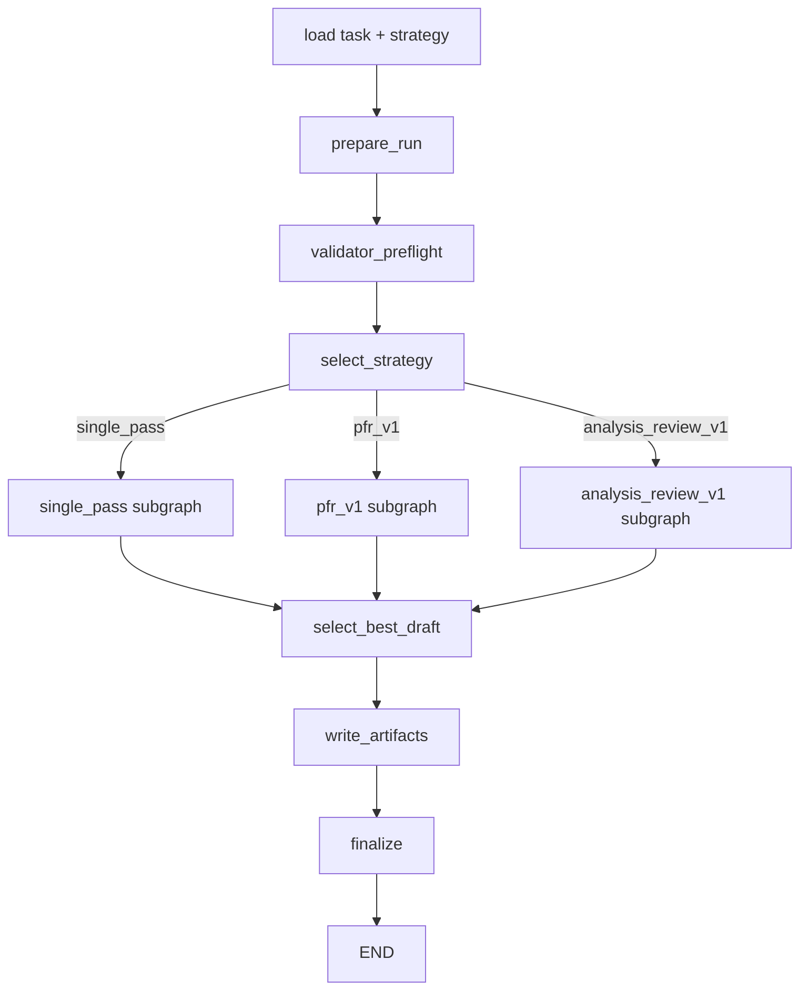

# ADR-0023 — LangGraph-backed Harness Surface in Forge

## Status
- Status: Draft
- Date (UTC): 2026-04-01
- Owner(s): Forge maintainers

## Scope
- New package: `anvil/harness/`
- Existing modules that remain in place:
  - `anvil/orchestration/*`
  - `anvil/providers/*`
  - `anvil/cli_agents/*`
  - `anvil/cli.py`
- Examples/tests to add:
  - `examples/harness/`
  - `tests/harness/`

## Context
Forge already has a LangGraph-backed execution path for the legacy leadership-oriented loop, but the workflow is fixed around `orchestrator -> execute -> critique -> refine -> review -> ...` and uses a `ForgeState` carrier pattern. That surface is useful and must remain available.

We also want a second, opt-in execution surface that implements the mini-harness task/strategy model:
- task YAML + strategy YAML
- strategy kinds such as `single_pass`, `pfr_v1`, `analysis_review_v1`
- workspace write policy enforcement
- validator applicability / preflight
- strong artifact generation (`REPORT.md`, `summary.json`, best draft / final answer files)
- first-class support for CLI agents (`codex`, `claude`) while retaining API/local providers

The goal is not to replace the current Forge loop. The goal is to add a cleaner, stateful, replayable harness surface that fits the mini-harness semantics and uses LangGraph natively.

## Decision
Forge will add a **new LangGraph-native harness surface** under `anvil/harness/`.

### The core decision
1. Add a separate `HarnessState`-based LangGraph graph for harness runs.
2. Keep the existing `ForgeState`-based LangGraph orchestration path unchanged.
3. Do **not** force the harness into the legacy `ForgeState` carrier model.
4. Treat harness execution as a parallel surface exposed by new CLI commands, not as a rewrite of existing Forge orchestration.

### Why
- The harness wants explicit, typed shared state with append-only histories, draft selection, policy results, validator rounds, and per-strategy routing.
- The current `{"state": ForgeState.to_dict()}` carrier pattern is workable for the legacy graph, but it is not the cleanest way to model the harness.
- A separate harness graph lets us keep the current leadership/RL path intact while making the new harness surface cleaner and easier to test.

## Non-goals
- Do not remove or weaken the current leadership / RL / hot-swap orchestration path.
- Do not rewrite `anvil/orchestration/*` to use `HarnessState`.
- Do not eliminate API/local provider support.
- Do not add human-approval interrupts in the first implementation pass; only preserve a design path for them.
- Do not merge the harness and legacy graphs into one large super-graph in this phase.

## Architectural shape

### New runtime surface
Create a dedicated harness package:

```text
anvil/harness/
  __init__.py
  cli.py
  types.py                  # Task/strategy/spec dataclasses or pydantic models
  state.py                  # HarnessState TypedDict + record helpers
  executor.py               # HarnessLangGraphExecutor
  builder.py                # parent graph builder + strategy routing
  graph_factory.py          # create_harness_graph()
  prompts.py                # prompt builders / prompt projection helpers
  artifacts.py              # run dirs, writes, artifact refs
  validation.py             # validator preflight + execution
  policy.py                 # workspace write policy evaluation
  reporting.py              # REPORT.md, summary.json, final draft files
  selection.py              # best draft selector
  provider_adapter.py       # normalize CLI/API/local providers for harness stages
  schemas.py                # structured output schemas
  nodes/
    __init__.py
    prepare_run.py
    select_strategy.py
    validator_preflight.py
    validator_round.py
    policy_guard.py
    proposer.py
    falsifier.py
    patcher.py
    critic.py
    reviser.py
    auditor.py
    select_best_draft.py
    write_artifacts.py
    finalize.py
  subgraphs/
    single_pass.py
    pfr_v1.py
    analysis_review_v1.py
```

### CLI entrypoints
Expose both:
- `python -m anvil.cli harness-run ...`
- `python -m anvil.harness.cli run ...`

The top-level CLI path is the user-facing entrypoint. The package-local CLI is a narrower internal/testing entrypoint.

### Checkpointing and runtime config
The harness executor will use LangGraph checkpointers directly and must support the same general modes as Forge:
- in-memory checkpoints for tests and ephemeral runs
- SQLite checkpoints for resumable local runs

Configuration precedence:
1. explicit CLI flags
2. harness-specific env vars
3. existing Forge env vars
4. defaults

Required env fallback behavior:
- `FORGE_HARNESS_LG_CHECKPOINT` falls back to `FORGE_LG_CHECKPOINT`
- `FORGE_HARNESS_LG_DB_PATH` falls back to `FORGE_LG_DB_PATH`
- `FORGE_HARNESS_MAX_ATTEMPTS` falls back to `FORGE_LG_MAX_ATTEMPTS`

## High-level graph topology



The harness parent graph owns:
- run preparation
- compatibility / preflight decisions
- selection of the strategy subgraph
- best-draft selection
- final artifact writing
- final verdict synthesis

Each strategy subgraph owns its own loop semantics.

## Provider abstraction decision
The harness will use a **provider adapter layer** instead of calling providers directly.

Reason:
- CLI providers support structured output, cwd, out-dir, access modes, max turns, and budget limits.
- API/local providers may only support `chat()` / `generate()` and may require prompt-based JSON shaping.
- The harness needs a single stage invocation contract regardless of provider family.

Create a normalized stage invocation API:

```python
@dataclass
class StageRequest:
    role_name: str
    provider_name: str
    model: str | None
    prompt_text: str
    schema: dict[str, Any] | None
    cwd: str
    out_dir: str
    access: str
    effort: str | None
    timeout_sec: int
    max_turns: int | None
    max_budget_usd: float | None
    extra_args: list[str]
    env: dict[str, str]

@dataclass
class StageRun:
    ok: bool
    role_name: str
    provider_name: str
    model: str | None
    text: str
    structured_output: dict[str, Any] | None
    command: list[str] | None
    duration_sec: float
    usage: dict[str, Any] | None
    warnings: list[str]
    artifact_paths: dict[str, str]
    raw_metadata: dict[str, Any]
    error: str | None
```

Rules:
- CLI providers use their native structured-output support when available.
- API/local providers must be wrapped so they can still return the same `StageRun` shape.
- Raw transcripts and large model payloads must go to artifacts, not graph state.

## Integration points with existing Forge code

### Reuse as-is
- `anvil/providers/*`
- `anvil/cli_agents/*`
- config loading / provider registry code
- checkpoint packages already required by Forge

### Add, do not replace
- `anvil/harness/*`
- harness CLI commands in `anvil/cli.py`
- harness examples/tests

### Shared utility extraction (allowed)
If useful, factor shared checkpoint / config helpers into a new utility module, but do not block the harness migration on a broad refactor of the legacy path.

## Compatibility rules
- The current `run`, `stream`, and other legacy orchestration commands must continue to work.
- The new harness surface must be opt-in.
- The harness must support CLI providers first-class and preserve API/local support.
- Task and strategy YAML from the mini-harness should be accepted with minimal or no semantic changes.

## Validation plan

### Unit tests
- harness graph compiles in memory mode
- harness graph compiles in SQLite mode
- strategy routing selects the expected subgraph
- provider adapter normalizes CLI and non-CLI providers into the same envelope

### Integration tests
- offline `analysis_review_v1` run with fake providers
- offline `pfr_v1` run with fake providers
- CLI entrypoint smoke test for `anvil.cli harness-run --help`

### Regression tests
- existing Forge LangGraph tests must continue to pass
- existing CLI-provider tests must continue to pass

## Acceptance criteria
- A user can run `python -m anvil.cli harness-run --task ... --strategy ... --workspace ...`.
- The harness uses a native LangGraph state schema rather than the `ForgeState` carrier pattern.
- Existing Forge orchestration remains intact.
- CLI and API/local providers can both participate in harness stages.
- Memory and SQLite checkpoint modes both work.

## Consequences
### Positive
- Cleaner harness control flow
- better checkpoint/resume shape
- explicit shared state rather than ad hoc imperative bookkeeping
- easier to add best-draft selection and future human approval

### Negative
- two execution surfaces will coexist in Forge
- some utility duplication may exist initially
- the harness provider adapter adds an extra abstraction layer

## Migration notes
This ADR only establishes the harness surface and its place in the repo. The authoritative state schema and strategy-subgraph contracts live in ADR-0024 and ADR-0025.
