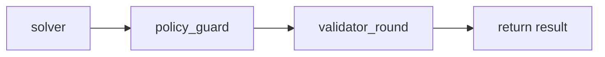
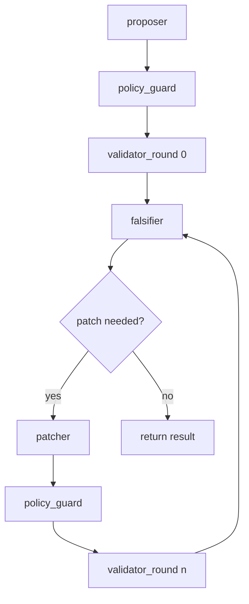
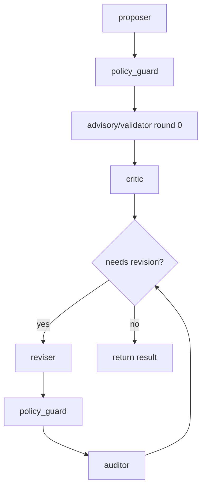

# ADR-0025 — Strategy Subgraphs, Node Contracts, and Migration Plan

## Status
- Status: Draft
- Date (UTC): 2026-04-01
- Owner(s): Forge maintainers

## Scope
- `anvil/harness/subgraphs/*.py`
- `anvil/harness/nodes/*.py`
- `anvil/harness/provider_adapter.py`
- `anvil/harness/cli.py`
- `anvil/cli.py`
- `examples/harness/*`
- `tests/harness/*`

## Context
The mini-harness approach depends on strategy-specific execution patterns, not one fixed loop:
- `single_pass`
- `pfr_v1`
- `analysis_review_v1`

Moving to LangGraph should make those patterns explicit. The strategies should become subgraphs with clean node contracts and shared parent-state outputs.

The harness also needs a migration plan that preserves current Forge features while landing the new surface in a controlled order.

## Decision
Each mini-harness strategy will become a dedicated LangGraph subgraph.

### Strategy list for the first implementation
- `single_pass`
- `pfr_v1`
- `analysis_review_v1`

The parent harness graph selects one subgraph based on task + strategy configuration. Each subgraph returns enough information to update the parent `HarnessState` and allow the common `select_best_draft -> write_artifacts -> finalize` tail to run.

## Decision detail: private subgraph state + parent mapping
Use wrapper nodes to call subgraphs with strategy-specific state rather than making every strategy share every parent key directly.

Why:
- cleaner strategy-local control flow
- easier to evolve per-strategy routing and local counters
- less clutter in the parent state schema
- easier to test each strategy independently

Pattern:
1. parent graph assembles a minimal strategy input payload from `HarnessState`
2. parent graph calls the strategy subgraph inside a wrapper node
3. strategy subgraph returns a structured result payload
4. wrapper node maps that result back into parent `HarnessState`

## Required node contracts

### 1) `prepare_run`
Responsibilities:
- load/validate task YAML and strategy YAML
- create run IDs and artifact directories
- capture initial git or non-git workspace state
- compute effective strategy compatibility policy
- initialize `HarnessState`

Inputs:
- CLI args / config

Outputs written to state:
- `run_id`, `thread_id`, `task_spec`, `strategy_spec`, `task_kind`, `strategy_kind`
- workspace paths
- initial snapshots
- empty histories and counters

### 2) `validator_preflight`
Responsibilities:
- examine validator applicability before any strategy work
- determine whether required validators are incompatible with the task kind or workspace surface
- decide whether to continue, downgrade to advisory, or mark config invalid

Outputs:
- preflight warnings/errors
- `validator_verdict` updates when clearly misconfigured

Rules:
- analysis-only tasks must not be forced through patch-style validators unless explicitly configured
- required invalid validators must yield `config_verdict=invalid_config` or be auto-downgraded if auto-fit is enabled

### 3) `policy_guard`
Responsibilities:
- evaluate `workspace_write_policy` against current workspace state
- append a `PolicyCheck`
- route to failure on violation

Rules:
- must run after any stage that might modify the workspace
- must run once at the end even if all stages were read-only

### 4) `validator_round`
Responsibilities:
- run applicable validators / advisory checks for the current round
- capture logs to artifacts
- append `ValidatorRound`

### 5) `select_best_draft`
Responsibilities:
- choose the best reviewed draft from all recorded drafts
- set `best_draft_id` and `selected_draft_id`
- never assume the latest draft is best

### 6) `write_artifacts`
Responsibilities:
- materialize the selected primary deliverable
- write `REPORT.md` and `summary.json`
- write `FINAL_ANSWER.*` only when the selected primary deliverable is a publishable final answer
- when trust final publication is blocked, fall through partial-answer eligibility before writing `BEST_DRAFT.*`

### 7) `finalize`
Responsibilities:
- synthesize final verdict axes into `run_verdict`
- set `summary_text`
- stamp completion metadata

## Strategy subgraph contracts

### `single_pass`
Use for:
- simple baseline tasks
- no review loop or only minimal validation

Expected flow:



Required outputs:
- at least one `DraftRecord`
- one or more `StageRecord`s
- validator results if configured
- content verdict proposal

### `pfr_v1`
Use for:
- patching tasks
- validator-driven repair loops

Expected flow:



Required routing rules:
- patch if required validators failed
- patch if falsifier verdict is `reject`
- patch if falsifier verdict is `inconclusive` and strategy says to patch on inconclusive
- stop when validators pass and falsifier has no blocking issues, or loop budget is exhausted

Required outputs:
- proposer and patcher drafts
- falsifier issues
- validator rounds
- content verdict proposal

### `analysis_review_v1`
Use for:
- analysis, advice, review, recommendations
- read-only tasks by default

Expected flow:



Required routing rules:
- always run the first critique/revision loop when `always_run_first_revision=true`
- continue looping while:
  - medium+ issues remain above threshold
  - grounding / actionability / scope scores are below thresholds
  - min loop count not yet met
- stop with `best_effort_exhausted` when max loop budget is hit and stop criteria are still not met

Required outputs:
- proposer and reviser drafts
- critic / auditor issues
- issue closure table from reviser
- score snapshots
- content verdict proposal

## Structured-output schemas

### Analysis-review deliverable schema
For `analysis_review` tasks, drafts must be structured as typed recommendations:

```json
{
  "summary": "...",
  "recommendations": [
    {
      "id": "rec-1",
      "title": "...",
      "classification": "confirmed_issue | risk | recommendation",
      "priority": "low | medium | high",
      "rationale": "...",
      "suggested_change": "...",
      "evidence": [
        {"path": "...", "lines": "...", "note": "..."}
      ],
      "confidence": 0.0
    }
  ],
  "open_questions": ["..."],
  "claims": ["..."]
}
```

### Review-result schema
Critic / auditor / falsifier style outputs should normalize to:

```json
{
  "verdict": "accept | revise | reject | inconclusive",
  "grounding_score": 0.0,
  "actionability_score": 0.0,
  "scope_compliance_score": 0.0,
  "issues": [
    {
      "issue_id": "iss-1",
      "severity": "low | medium | high | critical",
      "category": "factual_error | overclaim | missing_topic | validator_failure | policy_violation | other",
      "summary": "...",
      "rationale": "...",
      "evidence": []
    }
  ],
  "missing_topics": ["..."],
  "notes": ["..."]
}
```

### Issue-resolution schema for reviser / patcher
Required so the graph can detect whether issues were actually closed:

```json
{
  "issue_resolutions": [
    {
      "issue_id": "iss-1",
      "status": "fixed | partial | disagreed | waived",
      "note": "..."
    }
  ]
}
```

## Provider-adapter rules
The subgraphs must never depend directly on CLI-only or API-only provider behavior.

The provider adapter must:
- accept a role config + prompt + schema + cwd/out_dir
- call the underlying provider
- return the normalized `StageRun`
- write stage artifacts (prompt, raw response, parsed JSON, metadata)

Specific requirements:
- CLI providers should use native structured output where available
- API/local providers should emulate structured output through prompt/schema instructions plus parsing
- stage output parsing failures must be captured as stage errors, not silent fallbacks

## Strategy/task compatibility rules
The harness must validate task kind vs strategy kind before or during `prepare_run`.

Required behavior:
- `analysis_review` + `analysis_review_v1` => valid
- `patch` + `pfr_v1` => valid
- `patch` + `single_pass` => valid baseline
- `analysis_review` + `pfr_v1` => either
  - auto-fit to `analysis_review_v1` if auto-fit is enabled, or
  - mark `config_verdict=invalid_config` before expensive model work

Do not allow a clearly wrong strategy to fail only after a full run unless the user explicitly disables auto-fit.

## CLI and config surface
Add or preserve:

```text
python -m anvil.cli harness-run \
  --task <task.yaml> \
  --strategy <strategy.yaml> \
  --workspace <path> \
  --out-root <dir> \
  [--thread-id <id>] \
  [--checkpoint memory|sqlite] \
  [--auto-fit-strategy true|false]
```

Also add a narrow internal CLI:

```text
python -m anvil.harness.cli run ...
```

The CLI should print all verdict axes, not only `run_verdict`.

Required output fields:
- `run_verdict`
- `content_verdict`
- `validator_verdict`
- `policy_verdict`
- `config_verdict`
- `run_dir`
- `report`
- `summary`
- `final_artifact`

## Migration plan

### Phase 1 — Scaffolding
- add `anvil/harness/` package
- add task/strategy spec loaders
- add `HarnessState`
- add artifact helpers
- add provider adapter
- add empty graph builder / executor with a trivial `single_pass`

### Phase 2 — Deterministic rails
- add workspace policy module
- add validator preflight / round execution
- add report/summary writing
- add best-draft selector

### Phase 3 — Strategy subgraphs
- land `single_pass`
- land `pfr_v1`
- land `analysis_review_v1`

### Phase 4 — CLI + examples
- wire `anvil.cli harness-run`
- wire `anvil.harness.cli run`
- add example task/strategy YAMLs

### Phase 5 — Resume / checkpoint polish
- verify thread-id resume behavior
- verify SQLite checkpoints
- add non-destructive replay tests if practical

## Required test matrix

### Unit
- state projection helpers
- provider adapter parsing
- validator applicability
- policy guard
- best-draft selector
- issue-resolution handling

### Integration (offline)
- `single_pass` baseline with fake provider
- `pfr_v1` patch loop with fake provider and fake validators
- `analysis_review_v1` with critique/revision/auditor loop
- blocked trust final publication falls through to `PARTIAL_ANSWER.*` when eligible, otherwise `BEST_DRAFT.*`

### CLI
- `anvil.cli harness-run --help`
- run command writes artifacts and prints verdict axes

### Resume / persistence
- in-memory checkpoint smoke test
- SQLite checkpoint smoke test
- optional interrupt/resume smoke test if implemented in this phase

## Acceptance criteria
- Each strategy kind runs through its own LangGraph subgraph.
- The harness can select the best draft instead of blindly taking the last one.
- The harness writes `FINAL_ANSWER.*`, `PARTIAL_ANSWER.*`, or `BEST_DRAFT.*` according to publishable final-answer and partial-answer eligibility.
- Strategy/task mismatch is handled early and predictably.
- The new surface works with CLI providers first-class and still supports API/local providers.

## Consequences
### Positive
- strategy logic becomes explicit and testable
- revision loops become easier to reason about
- best-draft selection and verdict splitting become natural graph steps
- future human approval can be added at specific nodes without redesigning the harness

### Negative
- additional modules and tests increase maintenance surface
- some prompt and schema code will exist outside the legacy Forge path
- wrapper-node / subgraph mapping adds indirection
